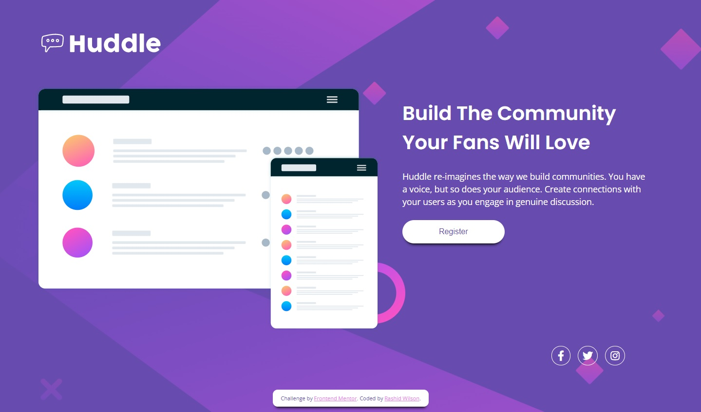

# Frontend Mentor - Huddle landing page with single introductory section solution

This is a solution to the [Huddle landing page with single introductory section challenge on Frontend Mentor](https://www.frontendmentor.io/challenges/huddle-landing-page-with-a-single-introductory-section-B_2Wvxgi0). Frontend Mentor challenges help you improve your coding skills by building realistic projects. 

## Table of contents

- [Overview](#overview)
  - [The challenge](#the-challenge)
  - [Screenshot](#screenshot)
  - [Links](#links)
- [My process](#my-process)
  - [Built with](#built-with)
  - [What I learned](#what-i-learned)
  - [Continued development](#continued-development)
- [Author](#author)

## Overview

### The challenge

Users should be able to:

- View the optimal layout for the page depending on their device's screen size
- See hover states for all interactive elements on the page

### Screenshot

### Links

- Live Site URL: [Hosted on Github Pages](https://shangum.github.io/Huddle-Landing-Page-Challenge-Frontend-Mentor/)

## My process

### Built with

- HTML markup
- Sass
- Flexbox
- Mobile-first workflow

### What I learned

This project was another practice run to keep myself familiar with designing a site using the mobile first approach. I was also working on building the habit of using Sass, mainly to get used to setting up an efficient workflow, and to continue to use responsive units in as many places as possible.

### Continued development

After I had most of the mobile design css in place and while moving to the Desktop design I noticed that I almost boxed myself into corners in the way I decided to structure the HTML. Ultimately I was able to work through this but realized that next time, before diving right into the mobile design, I will be more deliberate in making sure I structure my html such that it sits at a happy medium between ease of design for mobile and for desktop. I imagine that my intuition will get better with more practice but know that this is something I need to be cognizant of in future projects. Another area I would like to improve on is the positioning of element background images (Ex: "background-size"). To get the background image into an acceptable location and at proper scale I did a lot of trial and error and tinkering. With practice I want to have a better intuition on how to get background images to the proper size, scale, and position (via translations/offsets/etc) while utilizing less brute force tactics.

## Author

- Website - [Rashid Wilson](#)
- Frontend Mentor - [@shangum](https://www.frontendmentor.io/profile/shangum)
